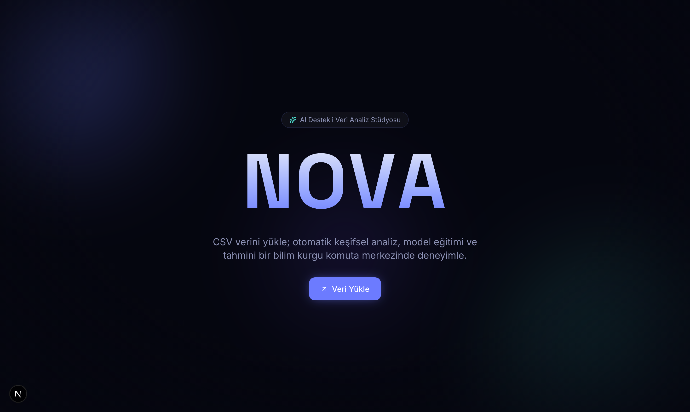
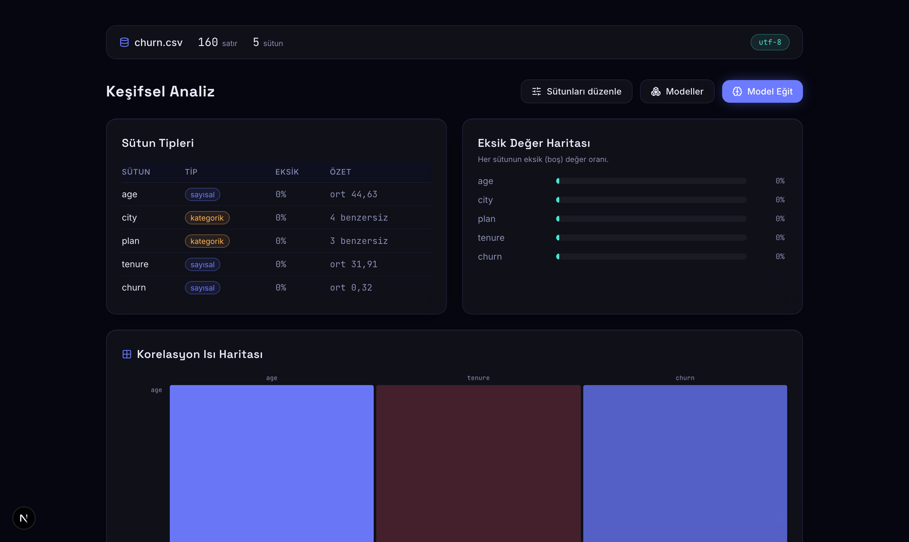
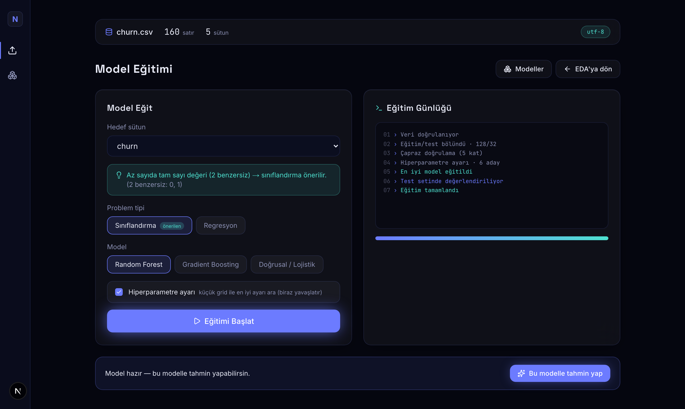
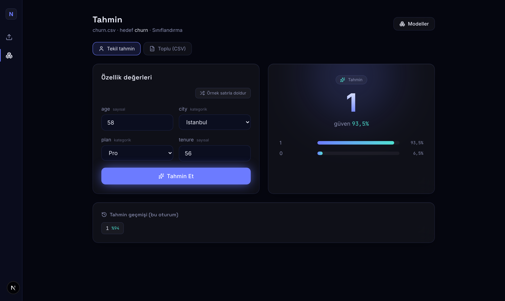
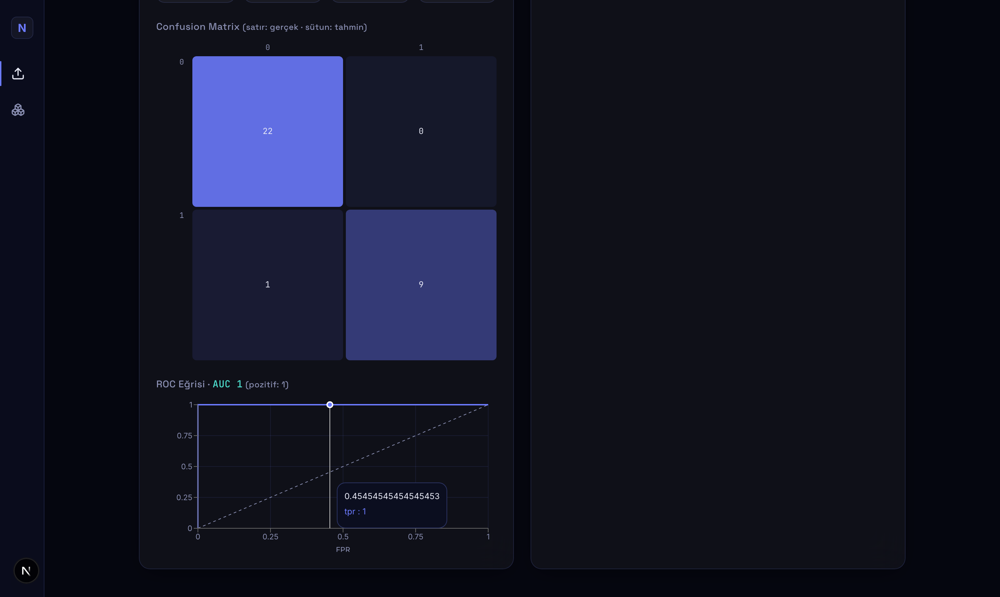
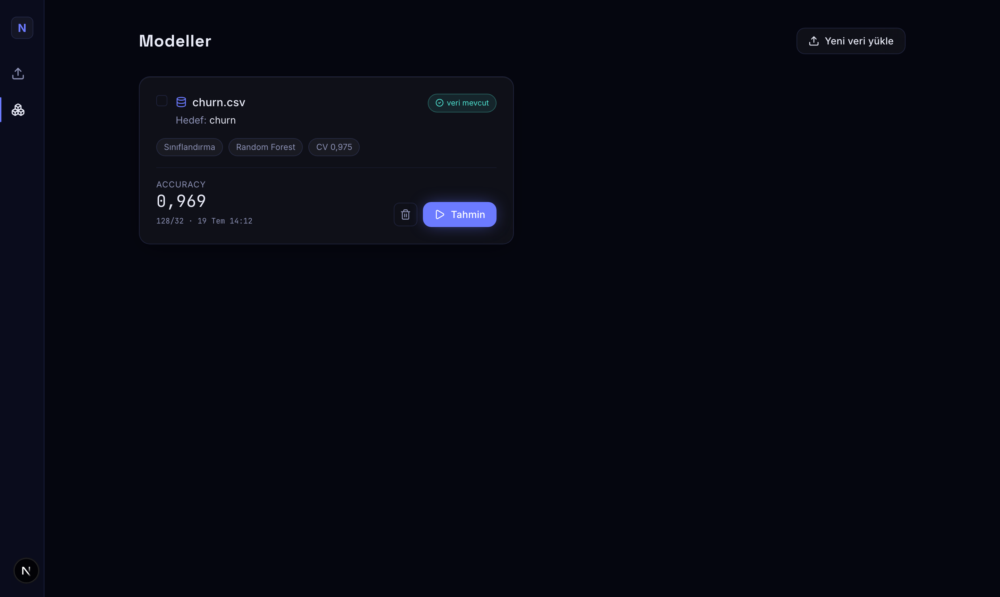

# NOVA — AI Destekli Veri Analiz Stüdyosu

CSV verisi yükleyip otomatik keşifsel veri analizi (EDA), makine öğrenmesi model
eğitimi ve tahmin yapabildiğin, **sinematik ve premium** hissiyatlı bir web
uygulaması. Estetik: *Deep Space Observatory* — bir uzay gözlemevinin komuta paneli.

Proje anayasası ve tasarım sistemi için bkz. [`CLAUDE.md`](./CLAUDE.md).
API sözleşmesi: [`docs/api-contract.md`](./docs/api-contract.md).
İleriki fikirler: [`docs/backlog.md`](./docs/backlog.md).
Ücretsiz canlıya alma (Vercel + Render): [`docs/deploy.md`](./docs/deploy.md).

## Ekran Görüntüleri

| Sinematik giriş | Otomatik EDA |
|---|---|
|  |  |

| Model eğitimi (gerçek adımlı SSE) | Tahmin (dramatik reveal) |
|---|---|
|  |  |

| Metrikler + ROC/AUC | Model listesi (sol nav rayı) |
|---|---|
|  |  |

> Görseller `docs/screenshots/` altında (nasıl yenilendiği:
> [`docs/screenshots/README.md`](./docs/screenshots/README.md)).

## 60 Saniyelik Demo

1. **Yükle (0:00–0:10):** `/studio`'ya git, bir CSV'yi sürükle-bırak (ör. yaş,
   şehir, plan, churn içeren bir tablo). Alan parlar, otomatik EDA'ya geçilir.
2. **Keşfet (0:10–0:25):** EDA dashboard'unda sütun tipleri, eksik değer haritası,
   korelasyon ısı haritası ve dağılımlar staggered animasyonla belirir.
   İstersen "Sütunları düzenle" ile grafik sütunlarını değiştir.
3. **Eğit (0:25–0:45):** "Model Eğit" → hedef sütunu seç (ör. `churn`). NOVA
   problem tipini **gerekçeli** önerir; "Eğitimi Başlat"a bas. Konsol **gerçek**
   adımları akıtır (ön işleme → 200/200 ağaç → değerlendirme). Accuracy/confusion
   matrix ve özellik önemi belirir.
4. **Tahmin et (0:45–1:00):** "Bu modelle tahmin yap" → form model şemasından
   otomatik üretilir; değerleri gir, sonuç güven yüzdesiyle dramatik biçimde açılır.
   Alternatif: "Toplu (CSV)" sekmesinde bir CSV yükleyip tablo + "CSV indir".

## Teknoloji

- **Backend:** Python 3.14 / FastAPI, pandas, numpy, scikit-learn
- **Frontend:** Next.js 16 (App Router, Turbopack) + TypeScript, Tailwind CSS v4, Framer Motion, Recharts, lucide-react

## Kurulum & Çalıştırma

### Backend

```bash
cd backend
python3 -m venv .venv
source .venv/bin/activate
pip install -r requirements.txt
uvicorn main:app --reload --port 8000
# → http://localhost:8000/api/health
```

### Frontend

```bash
cd frontend
npm install
npm run dev
# → http://localhost:3000
```

Frontend, backend adresini `NEXT_PUBLIC_API_URL` ortam değişkeninden okur
(varsayılan `http://localhost:8000`). Gerekiyorsa `frontend/.env.local`:

```bash
NEXT_PUBLIC_API_URL=http://localhost:8000
```

## Testler

```bash
# Backend
cd backend && source .venv/bin/activate && pytest -q

# Frontend
cd frontend && npm run lint && npx tsc --noEmit && npm run build
```

## Geliştirme Fazları

- **Faz 1 — İskelet** ✅ Monorepo, health endpoint, tasarım sistemi, sinematik landing.
- **Faz 2 — Veri Yükleme + EDA** ✅ Upload (encoding zinciri + doğrulama), drag & drop, animasyonlu EDA dashboard (sütun tipleri, eksik harita, korelasyon ısı haritası, dağılımlar, sütun seçici).
- **Faz 3 — Model Eğitimi (+ minimal tahmin)** ✅ SSE ile gerçek adımlı eğitim, problem tipi önerisi + override, test-seti metrikleri (confusion/residual), feature importance; eğitim/tahmin ortak sklearn Pipeline.
- **Faz 4 — Tahmin + Cila** ✅ Tekil tahmin formu (şemadan otomatik) + dramatik reveal, toplu CSV tahmini (tablo + indirme), model listesi (`source_dataset_available` rozeti), ortak empty/error state'ler, `prefers-reduced-motion` (MotionConfig), responsive.
- **Faz 5 — ML derinliği + sinematik UX** ✅ Cross-validation, ROC/AUC eğrisi, hiperparametre ayarı (GridSearchCV), permutation importance, regresyon güven aralığı; sol sinematik nav rayı, tahmin geçmişi, "örnek satırla doldur", model silme + karşılaştırma.
